# 2주차 (2022-03-15)
- 안드로이드 스튜디오 설치 & 깃허브 가입 및 저장소 생성
---
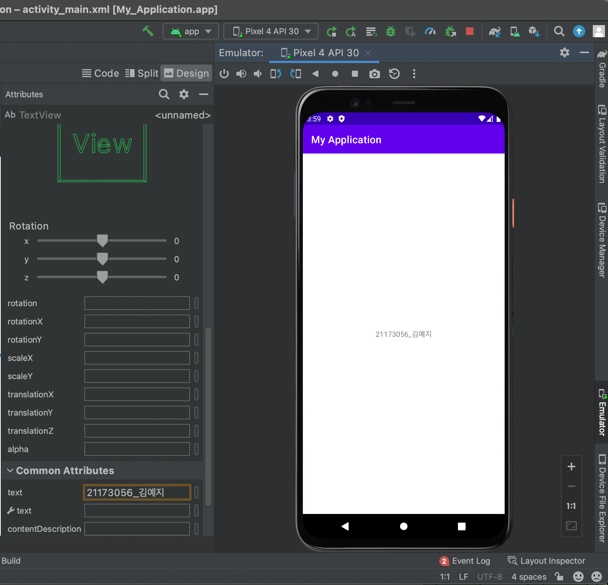</img>

# 3주차 과제 (2022-03-22)
- 메시지 띄우기 & 웹사이트 접속 & 전화 걸기 버튼 만들기
---
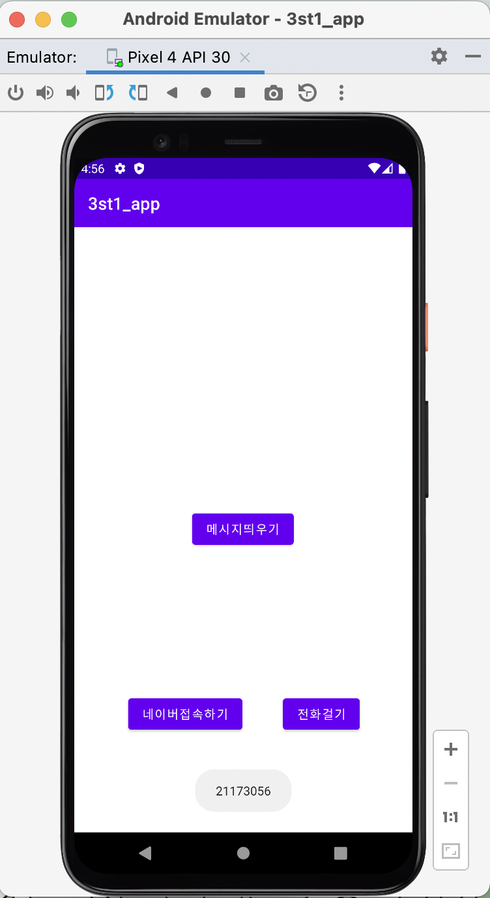</img>
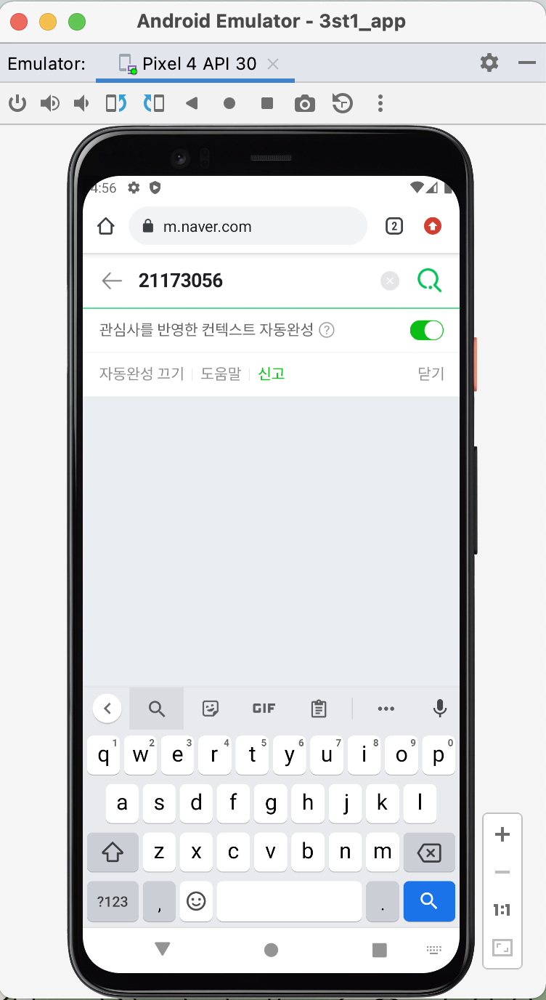</img>
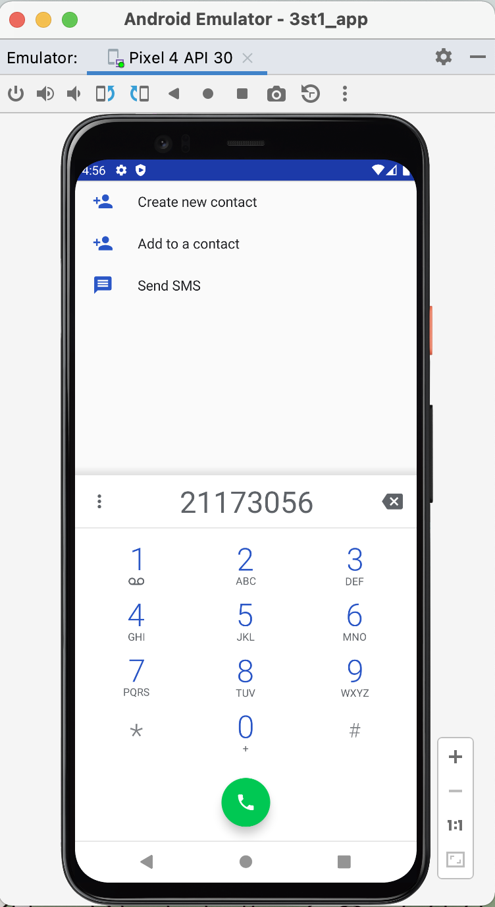</img>

# 5주차 (2022-04-05)
- 이미지 바꾸기 버튼으로 뷰의 이미지 바꾸기
---
***소스 파일***
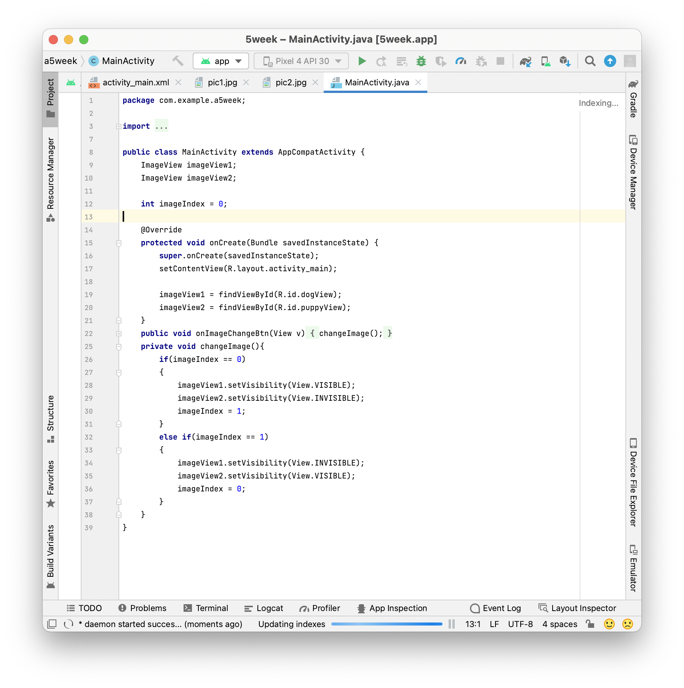</img>
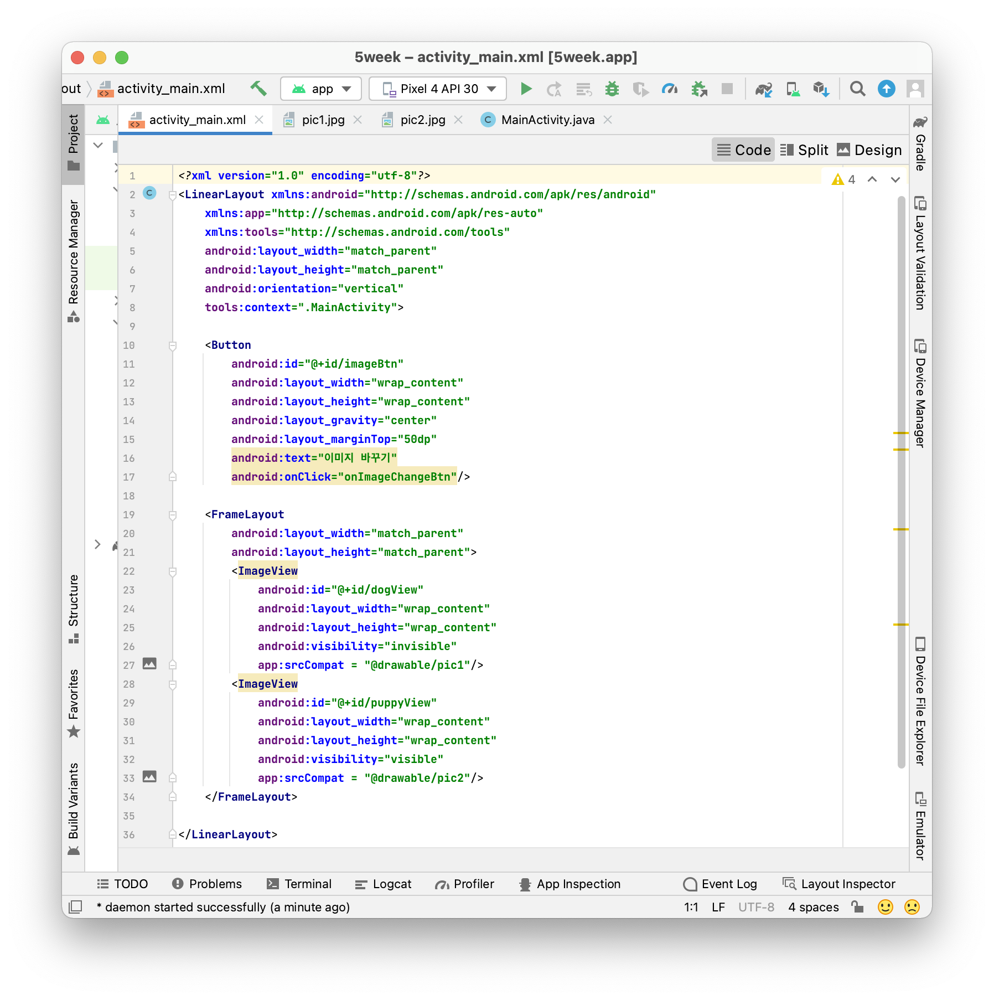</img>

---
***실행 화면***
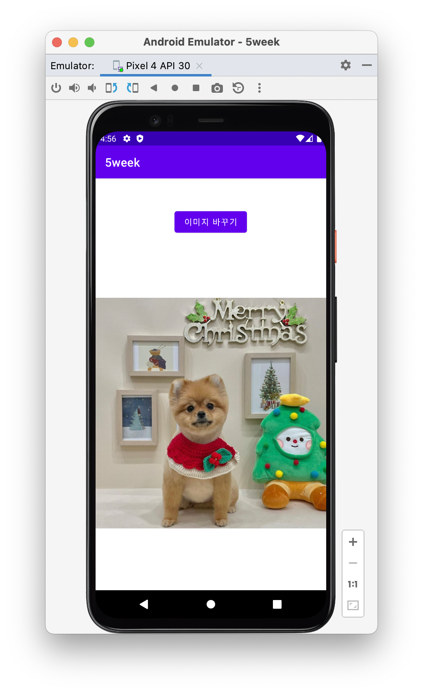</img>
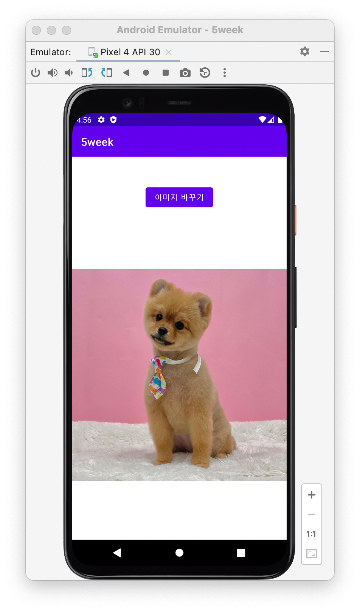</img>

# 6주차 (2022-04-12)
- 두 개의 버튼을 삽입하고 Toast.makeText()를 이용해 하단에 width, height 크기 값을 표시하기 (Interger.toString() 함수 사용)
---
***width***
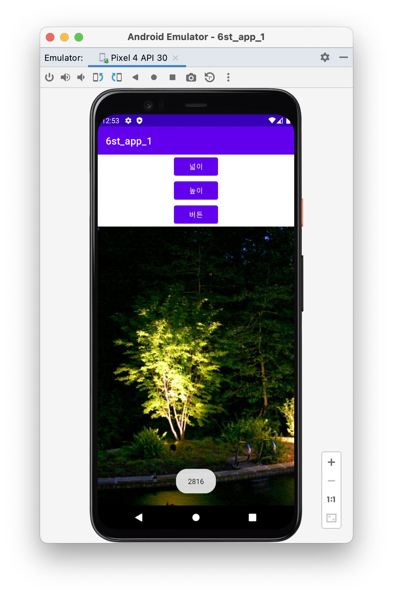</img>
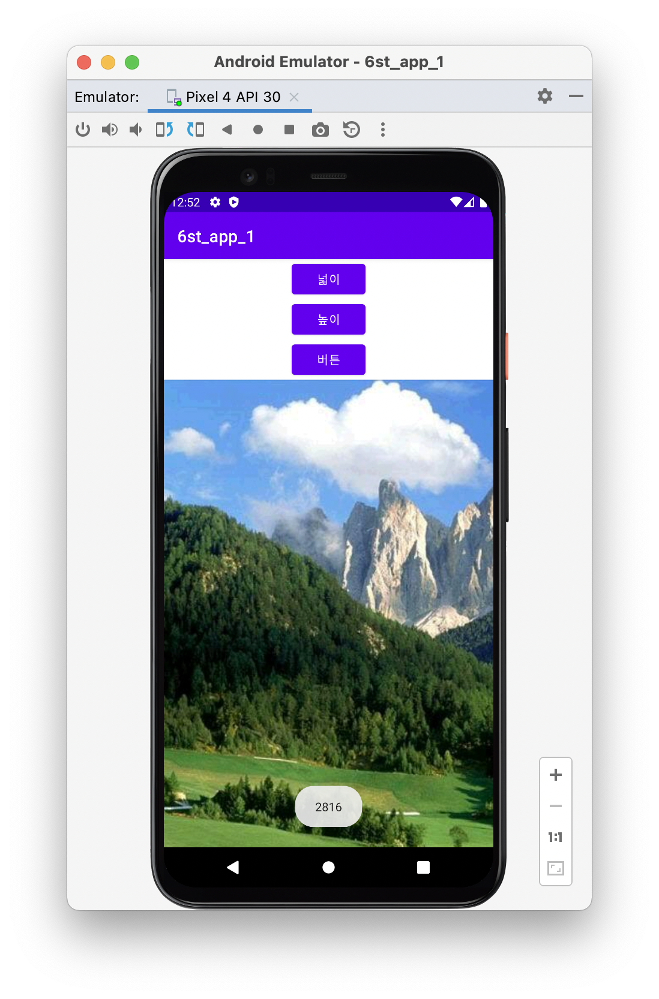</img>

---
***height***
</img>
</img>

# 10주차 (2022-05-10)
- 여러 화면 만들고 화면 간 전환하기
---
***Menu***
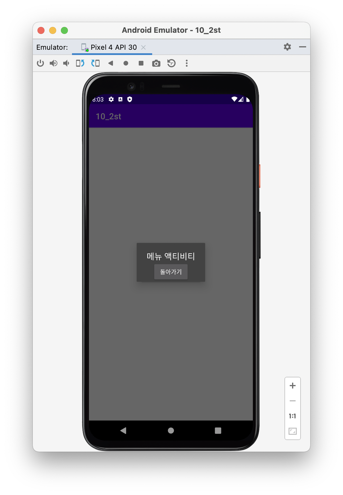</img>

---
***Main***
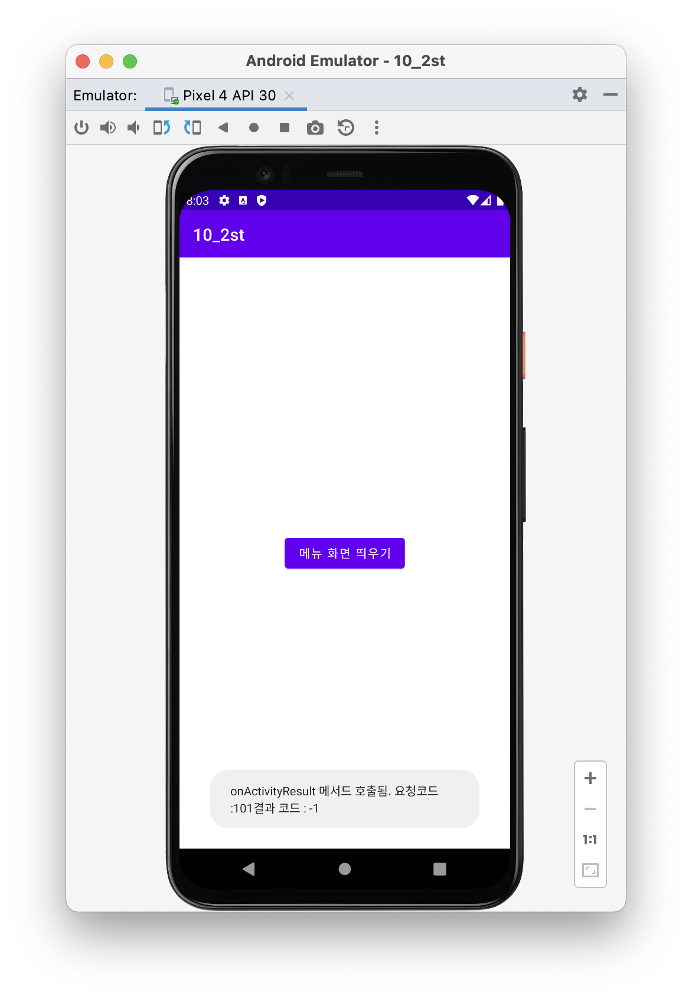</img>
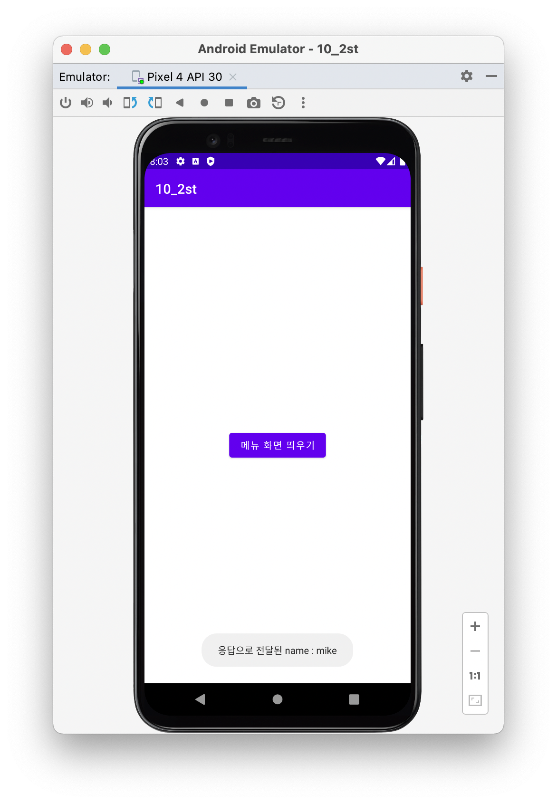</img>
